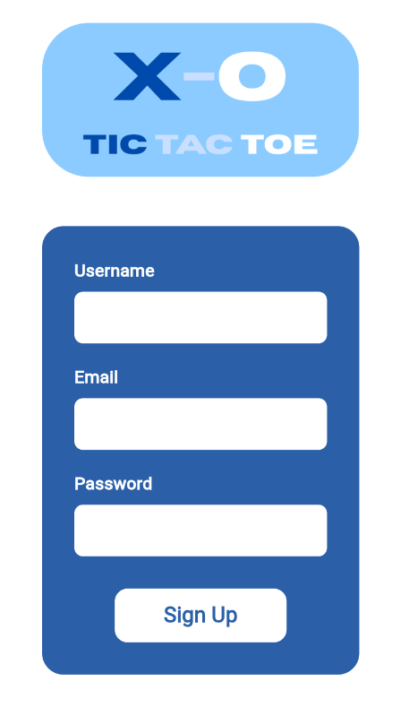
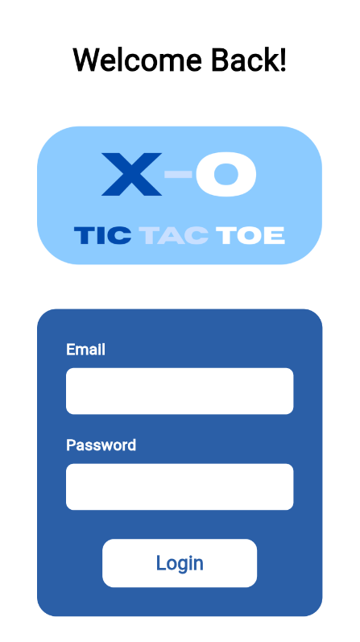
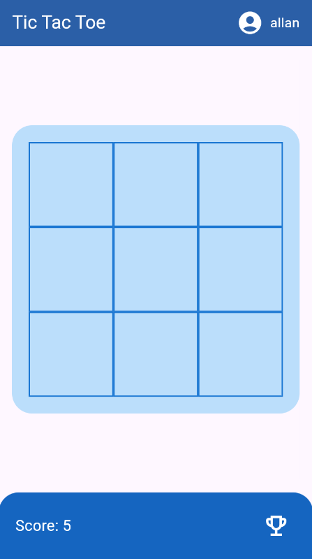
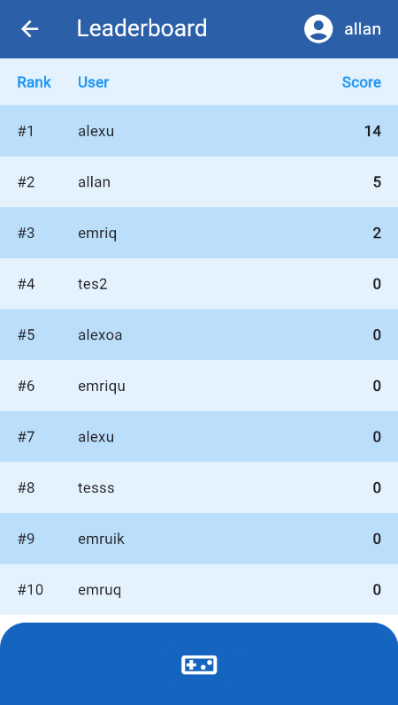
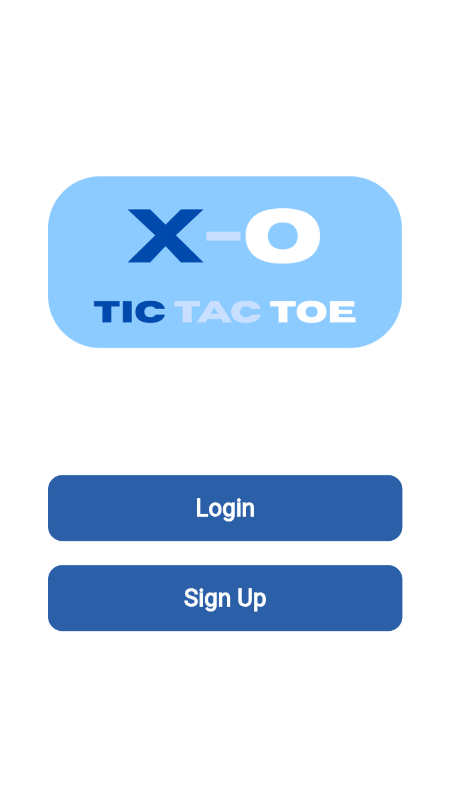

# TicTacTekber

## Description
TicTacTekber is a Flutter-based mobile application integrated with Firebase. The application allows users to log in and play a game against a bot, where the user’s score is stored and accumulated in Firebase.

Firebase is used for:
- User authentication
- Storing user scores
- Real-time leaderboard updates

The project supports Android, iOS, Web, Windows, macOS, and Linux, following Flutter’s multi-platform architecture


## Group Members

| Name                           | Student Number 
| :--------                      | :------- 
| Emriqurrizal Yahya Nurramadhan | 5026231001
| Alexander Allan                | 5026231050 


## Technologies Used

- Flutter (Dart)
- Firebase Authentication
- Firebase Firestore / Realtime Database
- Firebase Hosting (Web)
- Material UI

## Installation

Clone the repository
```bash
git clone https://github.com/Emriqurrizal/tictactekber
```
Go to the project directory
```bash
cd [your-project-directory]
```
Install Flutter dependencies
```bash
flutter pub get
```
Run the application
```bash
flutter run
```
For web:
```bash
flutter run -d chrome
```

    
## Firebase Setup

1. Create a Firebase project at `https://console.firebase.google.com`

2. Add your app to Firebase 
- Android: `android/app/google-services.json`
- iOS: `ios/Runner/GoogleService-Info.plist`
- Web: `Firebase config inside web/index.html`

3. Enable required services:
- Authentication (Email/Password)
- Firestore Database (or Realtime Database)

4. Example Firestore Structure:
```bash
users
 |--- userId
     |--- username: "player1"
     |--- score: 120
```
5. Run Firebase locally 
```bash
firebase init
firebase serve
```
## Screenshots
- Sign Up Page
- 
- Login Page
- 
- Game Page
- 
- Leaderboard Page
- 
- Home Page
- 

